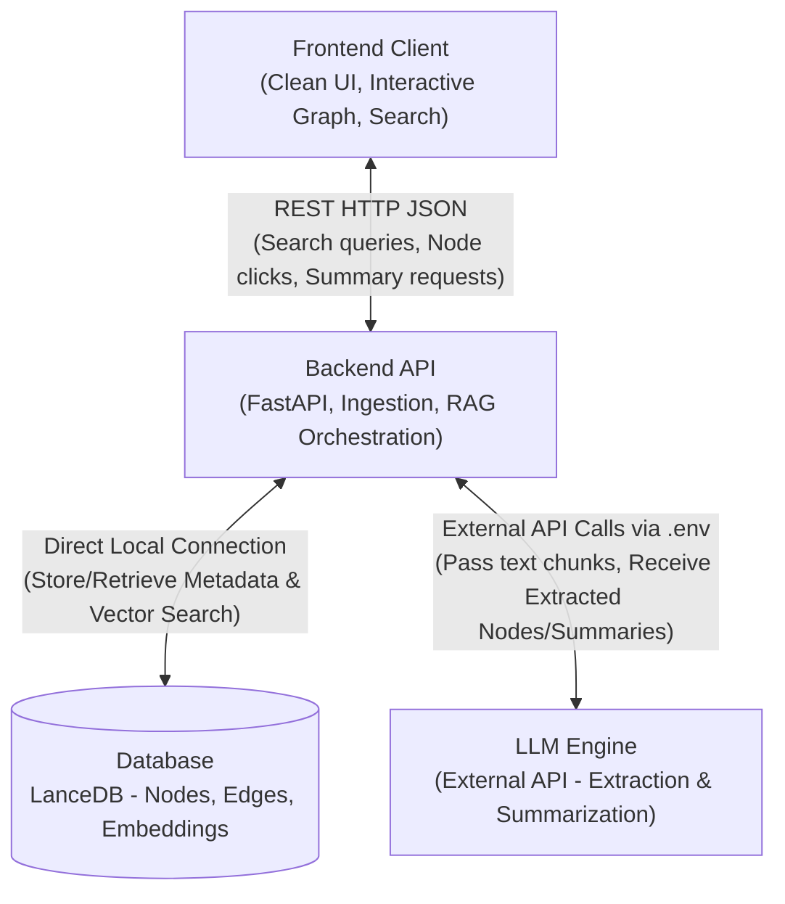

# Flow Diagram

```mermaid
flowchart TD
    %% Components based on Architecture.md
    Frontend["Frontend Client<br/>(Clean UI, Interactive Graph, Search)"]
    Backend["Backend API<br/>(FastAPI, Ingestion, RAG Orchestration)"]
    Database[("Database<br/>LanceDB - Nodes, Edges, Embeddings")]
    LLM["LLM Engine<br/>(External API - Extraction & Summarization)"]

    %% Connections based on Architecture.md
    Frontend <-->|"REST HTTP JSON<br/>(Search queries, Node clicks, Summary requests)"| Backend
    
    Backend <-->|"Direct Local Connection<br/>(Store/Retrieve Metadata & Vector Search)"| Database
    
    Backend <-->|"External API Calls via .env<br/>(Pass text chunks, Receive Extracted Nodes/Summaries)"| LLM
```
